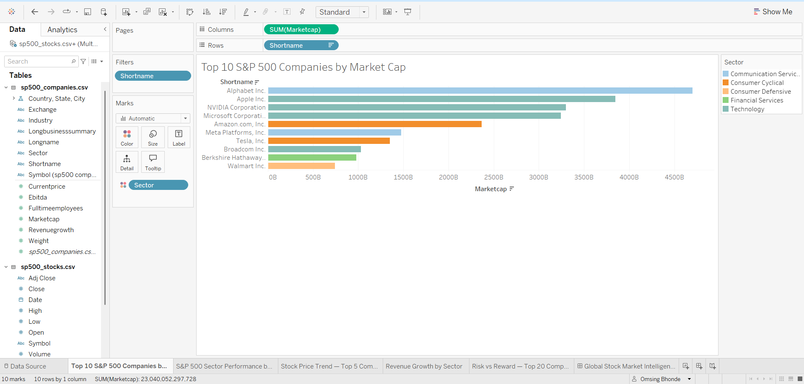
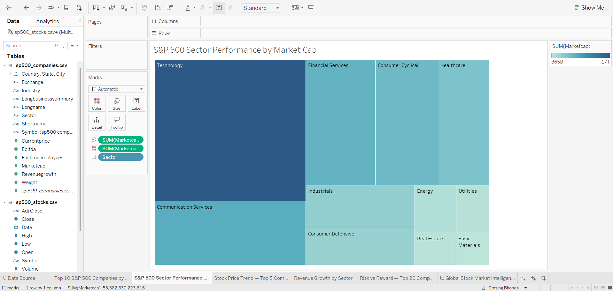
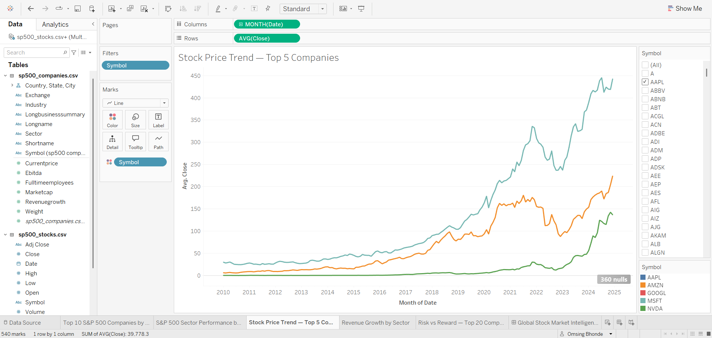
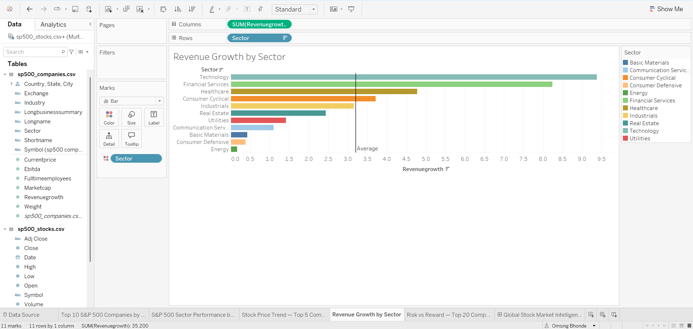
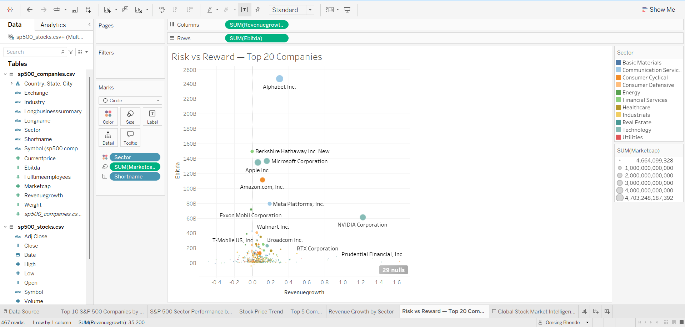

# 📈 Global Stock Market Intelligence Dashboard

## 🔍 Overview
An interactive Tableau dashboard analyzing S&P 500 
stock market data across 500+ companies from 2010-2024.

## 📊 Dashboard Features
- **Top 10 Companies by Market Cap** — Alphabet leads at $4.5T
- **Sector Performance Treemap** — Technology dominates S&P 500
- **Stock Price Trends** — NVIDIA's 1200% AI-driven growth visible
- **Revenue Growth by Sector** — Tech & Finance lead all sectors
- **Risk vs Reward Analysis** — Scatter plot of 20 top companies

## 💡 Key Insights
- NVIDIA showed most dramatic growth due to AI boom in 2023
- Technology sector alone bigger than next 3 sectors combined
- Alphabet has highest EBITDA ($260B) — most profitable company
- Financial Services shows surprisingly high revenue growth

## 🛠️ Tools Used
- **Tableau Public** — Data visualization
- **Dataset** — S&P 500 Stocks (Kaggle)
- **Data Points** — 176,000+ stock records

## 🔗 Live Dashboard
[View Interactive Dashboard on Tableau Public](https://public.tableau.com/app/profile/omsing.bhonde/viz/GlobalStockMarketIntelligenceDashboard/GlobalStockMarketIntelligenceDashboard1?publish=yes)

## 📸 Screenshots

### Dashboard Overview

### Top 10 Companies by Market Cap

### Stock Price Trend

### Revenue Growth by Sector

### Risk vs Reward

